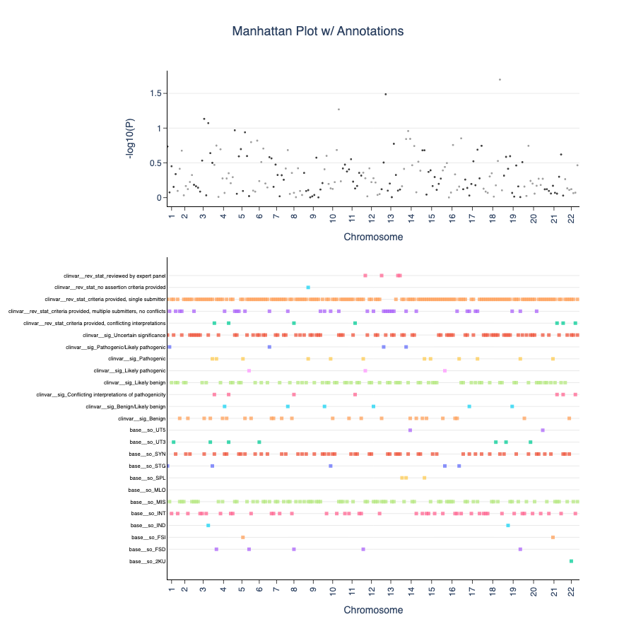

# Using OakVar to Annotate GWAS Summary Statistics for Fine-Mapping
This project is intended to help functionally annotate GWAS summary statistics files. It will output annotation parquet files typically used in fine-mapping workflows (e.g. PolyFun at https://github.com/omerwe/polyfun).

Genome-wide association studies (GWAS) are used to pinpoint genetic variants associated with complex human traits, but most of these variants denote false positives because they are correlated with true causal variants through linkage disequilibrium. Functionally informed fine-mapping solves this problem by prioritising causal variants and then aggregating them into credible sets of causal variantss. It also utilises relevant annotation data that adds functional elements to variants which will allow better determination of causality, and thus better insight into which variants should be investigated in subsequent functional studies.

This is where OakVar comes in! Here, we present a tool that can integrate OakVar's annotation modules as an annotation data source and then create annotation files specifically formatted for use in PolyFun’s functional fine-mapping workflow. We also provide code that can generate Manhattan plot visualisations coupled with annotations. 

To run an example, please use example_gwas.txt as an input file in the notebook. 

### Example Manhattan plot with annotation visualisations

